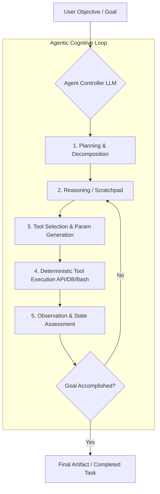

# Chapter 13: AI Agents & Autonomous Reasoning Loops

## 1. What is an AI Agent?

An **AI Agent** is an autonomous software entity that perceives its operational environment, reasons about goals, formulates multi-step execution plans, executes actions via deterministic tools/APIs, evaluates outcomes, and self-corrects until reaching objective termination.

Unlike static chat models that produce a single synchronous text completion, agents operate within a continuous **Perceive $\to$ Reason $\to$ Act $\to$ Observe** loop.



---

## 2. The Anatomy of an Agent System

Modern production agents (e.g. Claude Computer Use, OpenAI Assistants, LangGraph, AutoGen) consist of four interconnected components:

1. **The Brain (Foundation Model):** Large Multimodal Model performing reasoning, semantic routing, and structured argument generation.
2. **Planning & Reflection Engine:** Decomposes macro goals into sub-tasks (e.g. Plan-and-Solve, Tree-of-Thought).
3. **Memory Store:**
   - **Short-Term Working Memory:** Rolling conversation context window and scratchpad history.
   - **Long-Term Episodic Memory:** Vector database containing historical user preferences and task records.
4. **Tool Registry (Action Space):** Schema-defined external functions (SQL query runners, web scrapers, code execution sandboxes, REST APIs).

---

## 3. The ReAct Framework (Reasoning + Acting)

Formulated by Yao et al. (2022), **ReAct** interleaves explicit reasoning traces (*Thoughts*) with domain-specific actions (*Actions + Action Inputs*) and environment feedback (*Observations*):

```
Thought 1: I need to find the current stock price of Company X and calculate 15% dividend.
Action 1: stock_price_api(ticker="CMPX")
Observation 1: {"price": 142.50, "currency": "USD"}
Thought 2: The price is $142.50. Now I calculate 142.50 * 0.15.
Action 2: python_calculator(expression="142.50 * 0.15")
Observation 2: 21.375
Thought 3: I have all required values to answer the user query.
Final Answer: The estimated dividend payout per share is $21.38.
```

---

## 4. Hands-on Implementation: ReAct Agent Loop in Pure Python

```python
"""
Complete Production-Ready ReAct (Reasoning + Acting) Autonomous Agent Loop
"""
import json
import re

# 1. Deterministic Tool Registry
def tool_calculate(expression: str) -> str:
    try:
        # Safe mathematical evaluation
        allowed = set("0123456789+-*/(). ")
        if not all(c in allowed for c in expression):
            return "Error: Invalid characters"
        return str(eval(expression))
    except Exception as e:
        return f"Error: {e}"

def tool_database_lookup(user_id: str) -> str:
    db = {"usr_99": "Tier: Enterprise | Credits: $4,500 | Region: us-east-1"}
    return db.get(user_id.strip(), "User not found")

TOOL_REGISTRY = {
    "calculator": tool_calculate,
    "db_lookup": tool_database_lookup
}

# 2. Autonomous Agent Engine
class ReActAgent:
    def __init__(self, max_iterations: int = 5):
        self.max_iterations = max_iterations

    def run(self, goal: str):
        print(f"🎯 Objective: {goal}\n" + "="*50)
        scratchpad = []

        # Simulated multi-step execution loop
        for step in range(1, self.max_iterations + 1):
            # Step A: Reason & Decide Action
            if step == 1:
                thought = "I need to retrieve the credit balance for user usr_99 from the database."
                action = "db_lookup"
                action_input = "usr_99"
            elif step == 2:
                thought = "I got user record ($4,500). Now calculate remaining credit after 20% discount (4500 * 0.80)."
                action = "calculator"
                action_input = "4500 * 0.80"
            else:
                thought = "Task complete. Formulating final response."
                print(f"🧠 Final Thought: {thought}")
                return "User usr_99 has $3,600.00 remaining credit after a 20% discount."

            print(f"Step {step} | 💭 Thought: {thought}")
            print(f"Step {step} | 🛠️ Action: {action}({action_input})")

            # Step B: Execute Action via Tool Registry
            tool_fn = TOOL_REGISTRY.get(action)
            observation = tool_fn(action_input) if tool_fn else "Error: Unknown Tool"
            print(f"Step {step} | 👁️ Observation: {observation}\n")

# Run Agent
if __name__ == "__main__":
    agent = ReActAgent()
    final_output = agent.run("Find usr_99 credit balance and apply 20% discount.")
    print("✅ Result:", final_output)
```

---

## 5. Summary & Key Takeaways

1. **Beyond Single Completion:** Agents transform LLMs from passive text generators into active decision-making system engines.
2. **ReAct Paradigm:** Explicit reasoning prevents compounding hallucination errors by verifying real observations between every action.
3. **Safety & Guardrails:** Autonomous agents require loop budgets (`max_iterations`), strict timeout limits, and human-in-the-loop validation for irreversible actions.

---

[Next Chapter: Agentic AI & Advanced Multi-Agent Patterns →](./chapter-14-agentic-ai.md)

