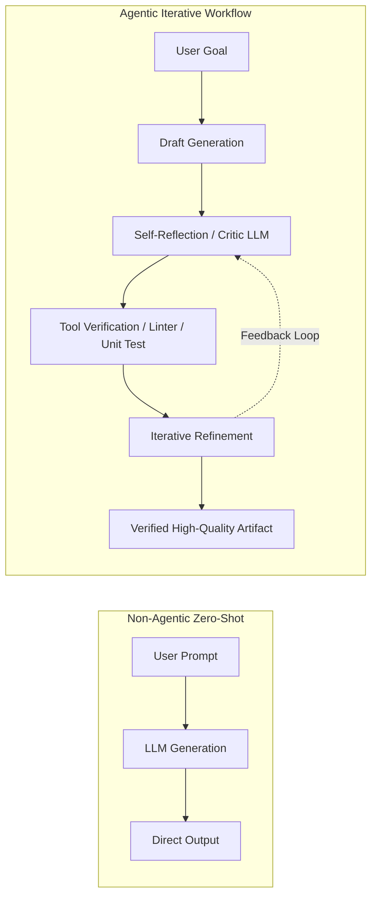
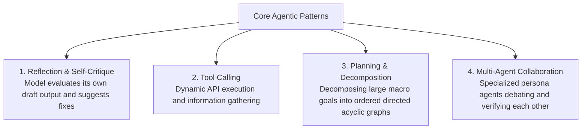

# Chapter 14: Agentic AI Design Patterns & Reflection Loops

## 1. What Defines "Agentic" AI?

Andrew Ng famously identified **Agentic Workflows** as the major catalyst expanding LLM application performance—often outperforming raw next-generation zero-shot base models through iterative reasoning and corrective self-reflection.



---

## 2. The 4 Fundamental Agentic Design Patterns



### 2.1 Pattern 1: Reflection & Self-Correction (Generator-Critic)
- **Mechanism:** The system splits generation into two distinct prompts or agents:
  1. **Generator:** Produces an initial draft (e.g. code implementation).
  2. **Critic / Evaluator:** Inspects the draft against explicit constraints, security guidelines, and test cases, returning actionable critique.

### 2.2 Pattern 2: Plan-and-Solve
- Rather than immediately beginning execution, the agent generates an explicit step-by-step DAG (Directed Acyclic Graph) of subtasks, executing each sequentially while retaining the global plan state.

---

## 3. Hands-on Implementation: Self-Refining Code Generation Agent in Python

```python
"""
Agentic Self-Correction Loop: Python Code Generation with Automated Reflection & AST Syntax Verification
"""
import ast

class SelfRefiningCodeAgent:
    def __init__(self, max_refinements: int = 3):
        self.max_refinements = max_refinements

    def mock_llm_generate(self, task: str, critique: str = None) -> str:
        # Simulates an initial buggy code response followed by a refined fix
        if critique is None:
            # Initial buggy version (Missing colon syntax error)
            return "def calculate_average(nums)\n    return sum(nums) / len(nums)"
        else:
            # Fixed version based on critique feedback
            return "def calculate_average(nums: list) -> float:\n    if not nums:\n        return 0.0\n    return sum(nums) / len(nums)"

    def verify_syntax(self, code: str) -> tuple[bool, str]:
        try:
            ast.parse(code)
            return True, "Syntax valid."
        except SyntaxError as e:
            return False, f"SyntaxError at line {e.lineno}: {e.msg}"

    def run(self, task: str) -> str:
        print(f"🚀 Task: {task}\n" + "-"*50)
        current_code = self.mock_llm_generate(task)
        
        for iteration in range(1, self.max_refinements + 1):
            print(f"Iteration #{iteration} Draft:\n{current_code}\n")
            is_valid, feedback = self.verify_syntax(current_code)

            if is_valid:
                print("✅ Verification Passed! Code is syntactically sound.")
                return current_code
            else:
                print(f"⚠️ Self-Correction Triggered: {feedback}")
                # Refine code using critique
                current_code = self.mock_llm_generate(task, critique=feedback)

        return current_code

# Demonstration
if __name__ == "__main__":
    agent = SelfRefiningCodeAgent()
    final_script = agent.run("Write a Python function to safely calculate average of a list.")
    print("\n--- Final Verified Output ---")
    print(final_script)
```

---

## 4. Summary & Key Takeaways

1. **Iteration Beats Raw Scale:** An iterative agentic workflow using a smaller, fast model consistently outperforms single-turn generation from massive models.
2. **Deterministic Feedback:** Grounding reflection in unit tests, linters, and compiler errors provides undeniable objective ground-truth feedback.
3. **Control Flow Flexibility:** Agentic workflows range from fixed deterministic state machines (LangGraph) to highly autonomous dynamic routing.

---

[Next Chapter: Tool Calling and Function Calling →](./chapter-15-tool-calling.md)
