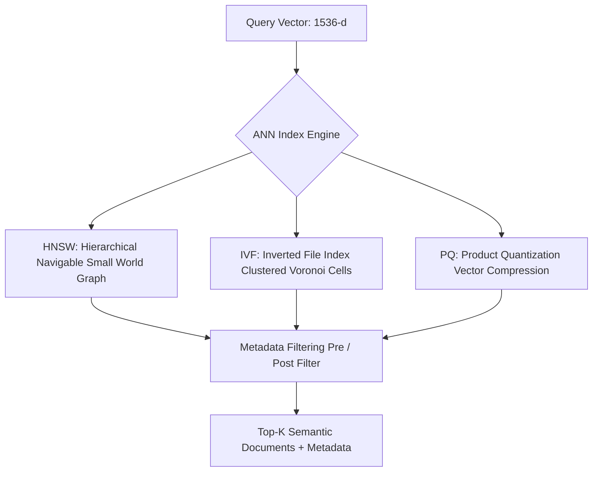

# Chapter 10: Vector Databases & Approximate Nearest Neighbors (ANN)

## 1. Why Vector Databases?

Traditional Relational (RDBMS) and NoSQL databases optimize for exact scalar equality, B-Tree ranges, and relational joins (O(log N)). 

However, searching over continuous high-dimensional vector spaces requires solving the **Nearest Neighbor Problem**. Performing exact k-Nearest Neighbors (kNN) via brute-force linear scan requires O(N * D) time complexity—which becomes computationally infeasible when querying millions or billions of 1536-dimensional embeddings with sub-50ms latency.

**Vector Databases** solve this challenge by trading marginal recall precision for logarithmic query times using **Approximate Nearest Neighbor (ANN)** indexing.



---

## 2. Core Approximate Nearest Neighbor (ANN) Algorithms

### 2.1 HNSW (Hierarchical Navigable Small World)
- **Concept:** Multi-layer graph skip-list structure where top layers contain long-range edges for coarse routing, and bottom layers contain dense local graphs for fine-grained convergence.
- **Characteristics:** Industry gold standard for recall/speed; slightly higher RAM footprint. Used in Pinecone, Qdrant, Weaviate, Milvus.

### 2.2 IVF (Inverted File Index)
- **Concept:** Partitions the continuous vector space into K Voronoi cells using k-means clustering. During query time, only vectors inside the closest n_probe centroids are scanned.

### 2.3 Product Quantization (PQ)
- **Concept:** Compresses high-dimensional vectors into compact 8-bit byte codes by decomposing vector subspaces, reducing RAM usage by up to 95%.


---

## 3. Metadata Filtering: Pre-Filtering vs. Post-Filtering

In production AI architectures, semantic queries are almost always paired with scalar filters (e.g., `user_id == '123' AND department == 'legal'`):

| Filtering Strategy | Mechanism | Engineering Risk |
| :--- | :--- | :--- |
| **Post-Filtering** | Run ANN search across all vectors first; discard results that fail scalar criteria. | Risk of returning zero results if matching documents fall outside initial top-$k$. |
| **Pre-Filtering** | Filter down valid document IDs first; execute brute-force search over subset. | Inefficient if the filtered subset remains very large. |
| **Iterative / Graph Filter (Single-Stage)** | Integrated into HNSW graph traversal directly (e.g., Qdrant payload filters). | Optimal recall and latency balance. |

---

## 4. Hands-on Implementation: Vector Store with Inverted Index & Metadata Filtering

```python
"""
Lightweight In-Memory Vector Store with Inverted Centroid Indexing and Pre-Filtering
"""
import numpy as np

class InMemoryVectorStore:
    def __init__(self, dim: int):
        self.dim = dim
        self.entries = []  # List of tuples: (doc_id, vector, metadata)

    def insert(self, doc_id: str, vector: np.ndarray, metadata: dict):
        norm_v = vector / np.linalg.norm(vector)
        self.entries.append((doc_id, norm_v, metadata))

    def query(self, query_vector: np.ndarray, filter_fn=None, top_k: int = 3) -> list[dict]:
        q_norm = query_vector / np.linalg.norm(query_vector)
        candidates = []

        for doc_id, v, meta in self.entries:
            # 1. Apply Metadata Pre-Filter
            if filter_fn and not filter_fn(meta):
                continue
            
            # 2. Compute Cosine Similarity
            score = float(np.dot(v, q_norm))
            candidates.append({
                "id": doc_id,
                "score": round(score, 4),
                "metadata": meta
            })

        # 3. Rank Top-K
        candidates.sort(key=lambda x: x["score"], reverse=True)
        return candidates[:top_k]

# Demonstration
if __name__ == "__main__":
    store = InMemoryVectorStore(dim=4)

    store.insert("doc_1", np.array([0.9, 0.1, 0.0, 0.2]), {"tenant": "acme", "env": "prod"})
    store.insert("doc_2", np.array([0.85, 0.15, 0.05, 0.1]), {"tenant": "globex", "env": "prod"})
    store.insert("doc_3", np.array([0.1, 0.9, 0.8, 0.0]), {"tenant": "acme", "env": "dev"})

    query_v = np.array([0.88, 0.12, 0.02, 0.15])
    # Search restricted to tenant 'acme'
    results = store.query(query_v, filter_fn=lambda m: m["tenant"] == "acme", top_k=2)

    print("--- Filtered Vector Search Results ---")
    for res in results:
        print(f"ID: {res['id']} | Score: {res['score']} | Metadata: {res['metadata']}")
```

---

## 5. Summary & Key Takeaways

1. **Exact vs Approximate:** Vector databases sacrifice microscopic recall margins for exponential logarithmic indexing speed via ANN (HNSW/IVF).
2. **Payload / Metadata Integration:** Real-world RAG requires robust single-stage hybrid filtering combining semantic vector similarity with business logic rules.
3. **Database Selection:** Modern engines (Pinecone, Qdrant, Weaviate, Milvus, pgvector) provide managed scaling, replication, and vector lifecycle management.

---

[Next Chapter: Retrieval-Augmented Generation (RAG) →](./chapter-11-rag.md)

