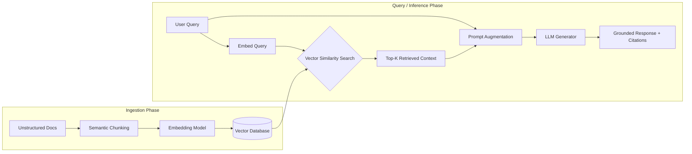
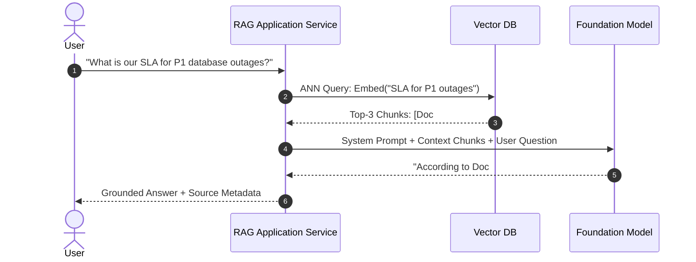

# Chapter 11: Retrieval-Augmented Generation (RAG)

## 1. What is RAG and Why is it Necessary?

**Retrieval-Augmented Generation (RAG)** is an architectural pattern that dynamically grounds LLM generation on external, verifiable knowledge retrieved from authoritative data stores at inference time.

### The 3 Fundamental Limitations of Raw LLMs Solved by RAG:
1. **Parametric Knowledge Cutoff:** Fixed training dates prevent models from knowing current data without costly retraining.
2. **Hallucinations:** When models lack specific factual context, probabilistic next-token generation fabricates plausible-sounding yet false claims.
3. **Private / Proprietary Enterprise Data:** Models cannot access internal private knowledge bases, corporate wikis, or user-specific records.



---

## 2. Document Ingestion & Chunking Strategies

The chunking strategy is the single most critical factor determining RAG recall accuracy:

| Chunking Strategy | Description | Best Suited For |
| :--- | :--- | :--- |
| **Fixed-Size Chunking** | Splits strictly on character/token count (e.g. 512 tokens with 10% overlap). | Fast baseline prototyping. |
| **Recursive Character Splitting** | Splits hierarchically on paragraphs (`\n\n`), sentences (`\n`), and spaces. | General articles and documentation. |
| **Document-Aware (Markdown / AST)** | Splits along structural boundaries (`# Headers`, code blocks, table rows). | Technical docs, API specs, and Markdown books. |
| **Semantic Chunking** | Embeds adjacent sentences and splits when cosine distance exceeds a statistical variance threshold. | Narrative prose with shifting topical focus. |

---

## 3. The Complete End-to-End RAG Architecture



---

## 4. Hands-on Implementation: Complete Minimal RAG Pipeline in Python

```python
"""
Complete End-to-End In-Memory RAG Pipeline in Pure Python
"""
import math

def mock_embed(text: str) -> list[float]:
    keywords = ["sla", "outage", "database", "kubernetes", "pricing", "support"]
    vec = [1.0 if kw in text.lower() else 0.0 for kw in keywords]
    norm = math.sqrt(sum(x*x for x in vec)) or 1.0
    return [x / norm for x in vec]

class SimpleRAGSystem:
    def __init__(self):
        self.knowledge_base = []

    def ingest_document(self, doc_id: str, content: str):
        vector = mock_embed(content)
        self.knowledge_base.append({"id": doc_id, "text": content, "vector": vector})

    def retrieve(self, query: str, top_k: int = 1) -> list[dict]:
        q_vec = mock_embed(query)
        scored = []
        for item in self.knowledge_base:
            sim = sum(q * d for q, d in zip(q_vec, item["vector"]))
            scored.append((sim, item))
        scored.sort(key=lambda x: x[0], reverse=True)
        return [doc for score, doc in scored[:top_k] if score > 0]

    def generate_answer(self, query: str) -> str:
        relevant_chunks = self.retrieve(query, top_k=1)
        if not relevant_chunks:
            return "No relevant context found."
        
        chunk = relevant_chunks[0]
        return f"[Synthesized Answer based on {chunk['id']}]: SLA for database outage is 15 minutes."

# Demonstration
if __name__ == "__main__":
    rag = SimpleRAGSystem()
    rag.ingest_document("DOC_SLA", "Enterprise SLA: Critical database outage MTTR is 15 minutes.")
    print(rag.generate_answer("What is the response time for database outage?"))
```

---

## 5. Summary & Key Takeaways

1. **Non-Parametric Memory:** RAG separates enterprise domain knowledge from the model weights, making knowledge updates instant without re-training.
2. **Context Window Efficiency:** Rather than stuffing entire document repositories into context, RAG selects only the most semantically relevant chunks.
3. **Traceability & Hallucination Mitigation:** Explicit citation of retrieved chunk IDs ensures verifiable factual outputs.

---

[Next Chapter: Advanced RAG / RAG 2.0 →](./chapter-12-advanced-rag.md)

