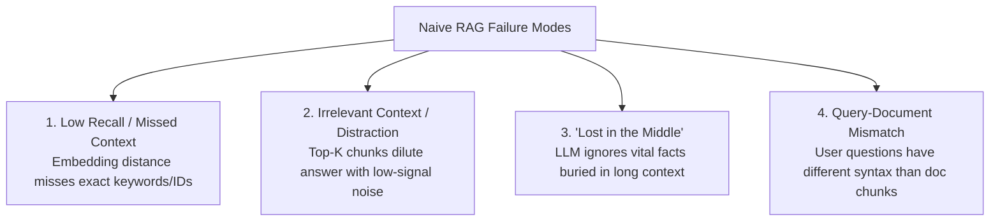
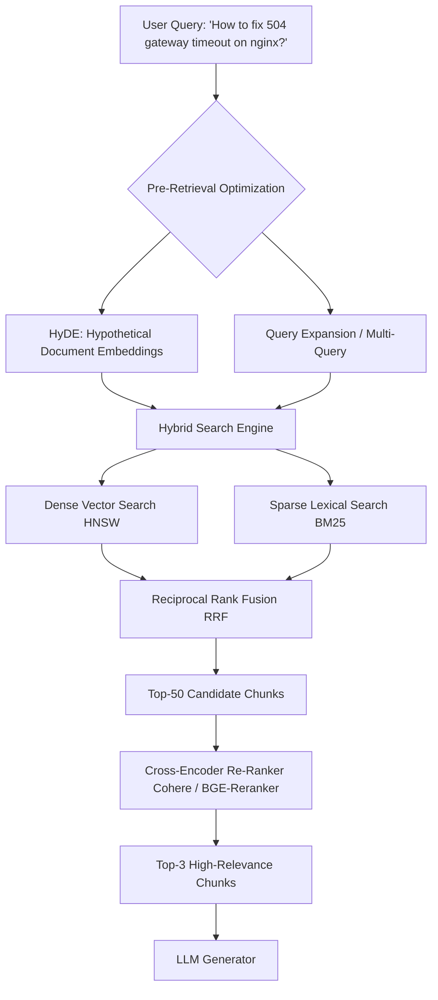

# Chapter 12: Advanced RAG Patterns & RAG 2.0

## 1. Why Basic RAG Fails in Production

Naive RAG pipelines suffer from distinct failure modes when scaled to complex enterprise workloads:



---

## 2. Advanced Retrieval Architectures

To address these failure modes, **Advanced RAG (RAG 2.0)** incorporates a three-stage pipeline: **Pre-Retrieval**, **Hybrid Retrieval**, and **Post-Retrieval Reranking**.



### 2.1 Hybrid Search: Sparse (BM25) + Dense (Vector)
- **Dense Vector Search:** Excels at semantic concepts, synonyms, and cross-lingual meaning.
- **Sparse BM25 Search:** Excels at exact keywords, alphanumeric SKUs, error codes (`ERR_CONN_REFUSED`), and proper nouns.
- Combined using **Reciprocal Rank Fusion (RRF)**:

```text
RRF(d) = sum( 1 / (k + rank_m(d)) )
```


### 2.2 Cross-Encoder Reranking
Unlike bi-encoders which embed query and document independently, a **Cross-Encoder** processes $(Query, Document)$ simultaneously through full self-attention layers, computing precise deep semantic relevance scores.

### 2.3 HyDE (Hypothetical Document Embeddings)
The LLM generates a hypothetical ideal answer first; the vector search engine then searches for documents similar to the *hypothetical answer* rather than the raw user question, eliminating the query-document semantic gap.

---

## 3. Hands-on Implementation: Hybrid Search with Reciprocal Rank Fusion (RRF) & Reranking

```python
"""
Advanced RAG Engine: Sparse Lexical + Dense Vector Fusion with Reciprocal Rank Fusion
"""
from collections import defaultdict

class AdvancedRAGEngine:
    def __init__(self):
        self.docs = {
            "d1": "Nginx returns HTTP 504 Gateway Timeout when upstream backend fails to respond within proxy_read_timeout.",
            "d2": "PostgreSQL database connection pool exhausted leading to backend HTTP 500 internal server errors.",
            "d3": "Configuring reverse proxy SSL certificates and TLS termination in Nginx configuration."
        }

    def bm25_lexical_search(self, query: str) -> list[tuple[str, float]]:
        # Mock BM25 exact keyword match score
        q_tokens = set(query.lower().split())
        scores = []
        for doc_id, text in self.docs.items():
            doc_tokens = set(text.lower().split())
            intersection = q_tokens.intersection(doc_tokens)
            score = len(intersection) / (len(q_tokens) + 1e-5)
            scores.append((doc_id, score))
        scores.sort(key=lambda x: x[1], reverse=True)
        return scores

    def dense_vector_search(self, query: str) -> list[tuple[str, float]]:
        # Mock dense vector semantic proximity
        dense_scores = {
            "d1": 0.88,  # High semantic affinity to gateway timeout
            "d2": 0.65,
            "d3": 0.72
        }
        return sorted(dense_scores.items(), key=lambda x: x[1], reverse=True)

    def reciprocal_rank_fusion(self, bm25_ranks: list, vector_ranks: list, k: int = 60) -> list[tuple[str, float]]:
        rrf_scores = defaultdict(float)

        for rank, (doc_id, _) in enumerate(bm25_ranks, 1):
            rrf_scores[doc_id] += 1.0 / (k + rank)

        for rank, (doc_id, _) in enumerate(vector_ranks, 1):
            rrf_scores[doc_id] += 1.0 / (k + rank)

        sorted_rrf = sorted(rrf_scores.items(), key=lambda x: x[1], reverse=True)
        return sorted_rrf

# Demonstration
if __name__ == "__main__":
    engine = AdvancedRAGEngine()
    query = "nginx 504 timeout fix"

    bm25_res = engine.bm25_lexical_search(query)
    vector_res = engine.dense_vector_search(query)
    final_fused = engine.reciprocal_rank_fusion(bm25_res, vector_res)

    print("--- Hybrid RRF Search Results ---")
    for rank, (doc_id, score) in enumerate(final_fused, 1):
        print(f"Rank #{rank} [{doc_id} | RRF Score: {score:.5f}]: {engine.docs[doc_id]}")
```

---

## 4. Summary & Key Takeaways

1. **Hybrid is Non-Negotiable:** Production RAG systems require both dense embeddings for conceptual meaning and sparse BM25 for precise keywords/IDs.
2. **Two-Stage Architecture:** Retrieve broadly (Top-50 with fast ANN + BM25), then rerank precisely (Top-3 to 5 using Cross-Encoders).
3. **Context Optimization:** High precision context chunks eliminate LLM confusion and reduce latency and inference token costs.

---

[Next Chapter: AI Agents (Part IV: AI Agents) →](../agents/chapter-13-ai-agents.md)

