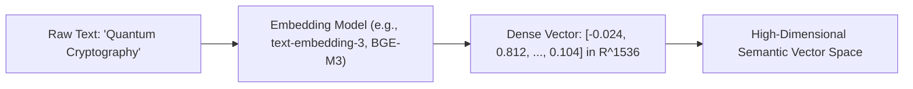
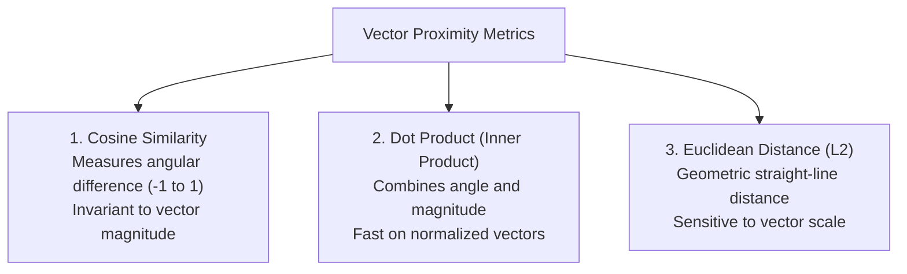

# Chapter 9: Vector Embeddings & Semantic Geometry

## 1. What are Vector Embeddings?

A **Vector Embedding** is a dense numerical representation of unstructured data (text, images, audio, code, graphs) mapped into a continuous, high-dimensional latent space $\mathbb{R}^D$ (where $D$ typically ranges from 384 to 3072 dimensions).

Unlike sparse representations (such as One-Hot Encoding or TF-IDF) where each dimension corresponds to an exact lexical term, dense embeddings capture **semantic meaning, contextual nuance, and conceptual relationships**.



---

## 2. Vector Similarity Metrics

To measure semantic proximity between two vectors $\mathbf{u}$ and $\mathbf{v}$, AI engineers use three primary distance metrics:



### Mathematical Definitions:

```text
1. Cosine Similarity:
   Cosine(u, v) = (u · v) / (||u|| * ||v||)

2. Euclidean Distance (L2):
   d(u, v) = sqrt(sum((u_i - v_i)^2))

3. Dot Product:
   <u, v> = sum(u_i * v_i)
   (Note: If vectors are L2-normalized, Dot Product is equal to Cosine Similarity).
```


---

## 3. Semantic Arithmetic & Vector Algebra

```text
vec(King) - vec(Man) + vec(Woman) ≈ vec(Queen)
```


In modern production systems, this algebraic property enables:
- **Zero-shot semantic clustering**
- **Cross-lingual document retrieval**
- **Multimodal image-text search (CLIP models)**

---

## 4. Hands-on Implementation: Vector Embedding Space & Similarity Search Engine

```python
"""
Production Implementation of Vector Normalization, Similarity Search, and Semantic Clustering
"""
import numpy as np

class VectorSearchEngine:
    def __init__(self):
        self.documents = []
        self.vectors = None

    def add_documents(self, docs: list[str], vectors: np.ndarray):
        self.documents.extend(docs)
        # Normalize vectors for fast dot-product cosine equivalence
        norms = np.linalg.norm(vectors, axis=1, keepdims=True)
        normalized_vectors = vectors / np.maximum(norms, 1e-12)

        if self.vectors is None:
            self.vectors = normalized_vectors
        else:
            self.vectors = np.vstack([self.vectors, normalized_vectors])

    def search(self, query_vector: np.ndarray, top_k: int = 3) -> list[dict]:
        # 1. Normalize query
        q_norm = query_vector / np.maximum(np.linalg.norm(query_vector), 1e-12)

        # 2. Compute Cosine Similarities via Matrix Multiplication: (N, D) x (D, 1) -> (N,)
        similarities = np.dot(self.vectors, q_norm)

        # 3. Top-K ArgSort
        top_indices = np.argsort(similarities)[::-1][:top_k]

        return [
            {
                "document": self.documents[idx],
                "score": round(float(similarities[idx]), 4)
            }
            for idx in top_indices
        ]

# Demonstration with synthetic 4D semantic vectors
if __name__ == "__main__":
    docs = [
        "Kubernetes container orchestration guide",
        "Docker container image optimization",
        "Baking sourdough bread at home",
        "Deploying microservices with Helm"
    ]
    # Synthetic semantic vectors: [Tech, Cloud, Baking, Cooking]
    doc_vectors = np.array([
        [0.95, 0.90, 0.05, 0.02],
        [0.92, 0.88, 0.01, 0.03],
        [0.02, 0.01, 0.98, 0.92],
        [0.90, 0.94, 0.04, 0.01]
    ])

    engine = VectorSearchEngine()
    engine.add_documents(docs, doc_vectors)

    # Query: "Cloud container deployment"
    query_vec = np.array([0.91, 0.93, 0.02, 0.01])
    results = engine.search(query_vec, top_k=2)

    print("--- Vector Search Top Matches ---")
    for rank, res in enumerate(results, 1):
        print(f"#{rank} [Score: {res['score']}] {res['document']}")
```

---

## 5. Summary & Key Takeaways

1. **Geometry is Meaning:** Vectors translate human language into continuous mathematical coordinates where distance directly corresponds to semantic relatedness.
2. **Normalization Optimizes Latency:** Normalizing embeddings beforehand allows cosine similarity to be computed as an extremely fast single matrix multiplication.
3. **Foundation of Retrieval:** Embeddings are the essential building block for Vector Databases and Retrieval-Augmented Generation (RAG).

---

[Next Chapter: Vector Databases →](./chapter-10-vector-databases.md)

