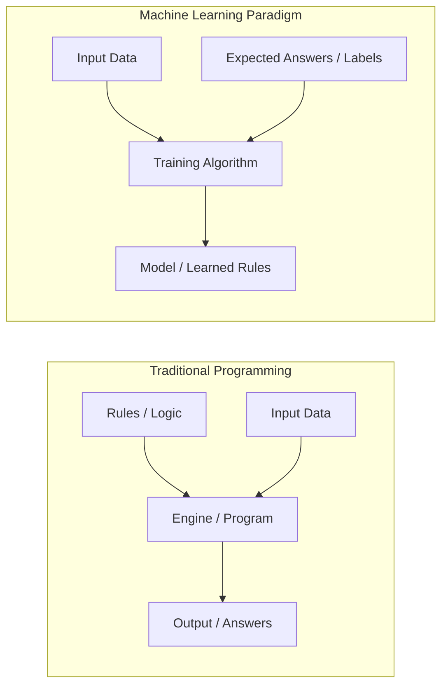
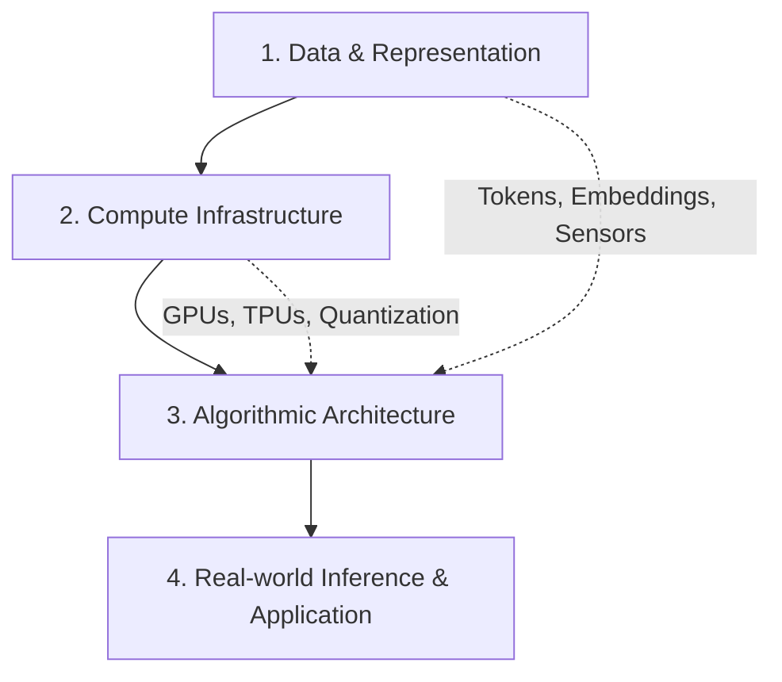

# Chapter 1: What is Artificial Intelligence?

## 1. Overview & Definition

**Artificial Intelligence (AI)** is a multidisciplinary field of computer science dedicated to creating systems capable of performing tasks that traditionally require human cognitive abilities. These abilities include visual perception, speech recognition, decision-making, pattern discovery, and natural language understanding.

In classical computing, software engineers write explicit deterministic logic (*Rules + Data = Answers*). In modern AI—specifically machine learning—systems ingest examples and outputs to infer mathematical functions and representations (*Data + Answers = Rules*).



---

## 2. A Brief History & Evolution

The evolution of AI spans over seven decades of conceptual breakthroughs, seasonal "AI winters", and rapid technological acceleration:

1. **The Symbolic & Logic Era (1950s–1980s):**
   - **Alan Turing (1950):** Proposed the "Imitation Game" (Turing Test) to evaluate machine intelligence.
   - **Dartmouth Workshop (1956):** John McCarthy, Marvin Minsky, Nathaniel Rochester, and Claude Shannon coined the term *Artificial Intelligence*.
   - **Expert Systems & Knowledge Graphs:** Rule-based decision trees with hardcoded human expertise (e.g., MYCIN, DENDRAL).
2. **The Statistical & Machine Learning Era (1990s–2010s):**
   - Shift from hand-engineered heuristic rules to probabilistic algorithms (Support Vector Machines, Random Forests, Bayesian Networks).
   - IBM Deep Blue defeated Garry Kasparov at chess (1997).
3. **The Deep Learning & Big Data Revolution (2012–2020):**
   - **AlexNet (2012):** Convolutional Neural Networks powered by GPUs dominated ImageNet benchmark classification.
   - **AlphaGo (2016):** DeepMind's reinforcement learning agent defeated world champion Lee Sedol.
   - **Transformer Architecture (2017):** Google introduced the self-attention mechanism in the paper *"Attention Is All You Need"*, unlocking scalable language representation.
4. **The Generative & Agentic AI Era (2020s–Present):**
   - Foundation models (GPT-4, Gemini, Claude, LLaMA) with billions of parameters.
   - Autonomous agents executing multistep workflows, tool calling, reasoning, and physical actuation.

---

## 3. Core Components of Modern AI Systems

Every production AI system relies on three foundational pillars:



- **Data & Features:** Unstructured (text, audio, images, video) and structured (tabular, relational) data transformed into multidimensional vector spaces.
- **Compute:** Parallel computation hardware (NVIDIA GPUs, Google TPUs) executing billions of tensor matrix multiplications per second.
- **Algorithms:** Architectures like Deep Neural Networks, Transformers, Diffusion Models, and Reinforcement Learning with Human Feedback (RLHF).

---

## 4. Real-World Engineering Example: Deterministic vs. AI Approach

Let's look at a concrete Python example comparing traditional rule-based classification against a statistical AI approach for sentiment analysis:

```python
import numpy as np

# --- Approach 1: Classical Deterministic (Rule-Based) ---
def rule_based_sentiment(text: str) -> str:
    positive_lexicon = {"good", "great", "excellent", "fast", "reliable", "love"}
    negative_lexicon = {"bad", "slow", "broken", "terrible", "poor", "hate"}
    
    tokens = text.lower().split()
    pos_count = sum(1 for word in tokens if word in positive_lexicon)
    neg_count = sum(1 for word in tokens if word in negative_lexicon)
    
    if pos_count > neg_count:
        return "Positive"
    elif neg_count > pos_count:
        return "Negative"
    return "Neutral"

# --- Approach 2: AI / Statistical Model (Simplified Logistic Classifier) ---
class LinearSentimentModel:
    def __init__(self):
        # Learned weights and bias for key semantic features
        self.vocabulary = {"fast": 0, "broken": 1, "great": 2, "buggy": 3}
        self.weights = np.array([1.45, -1.80, 2.10, -1.65])
        self.bias = 0.05

    def sigmoid(self, z: float) -> float:
        return 1.0 / (1.0 + np.exp(-z))

    def predict(self, text: str) -> dict:
        # 1. Feature Extraction (Bag-of-Words Vector)
        vector = np.zeros(len(self.vocabulary))
        for word in text.lower().split():
            if word in self.vocabulary:
                vector[self.vocabulary[word]] += 1.0
        
        # 2. Linear Combination + Activation (Inference)
        logit = np.dot(vector, self.weights) + self.bias
        probability = self.sigmoid(logit)
        
        sentiment = "Positive" if probability >= 0.5 else "Negative"
        return {
            "sentiment": sentiment,
            "confidence": round(float(probability), 4)
        }

# Execution & Comparison
sample = "The server is fast but has a broken configuration"
print("Rule-Based Output :", rule_based_sentiment(sample))
print("AI Model Output   :", LinearSentimentModel().predict(sample))
```

---

## 5. Summary & Key Takeaways

1. **Mathematical Foundation:** AI is not conscious thinking; it is mathematical approximation, statistical probability, and optimization across high-dimensional spaces.
2. **Generalization:** The real strength of AI lies in its ability to generalize to unseen data that was not present in the training set.
3. **Engineers' Responsibility:** AI engineering requires understanding model capabilities, limitations, latency/cost trade-offs, and ethical implications.

---

[Next Chapter: Types of Artificial Intelligence →](./chapter-2-types-of-ai.md)

