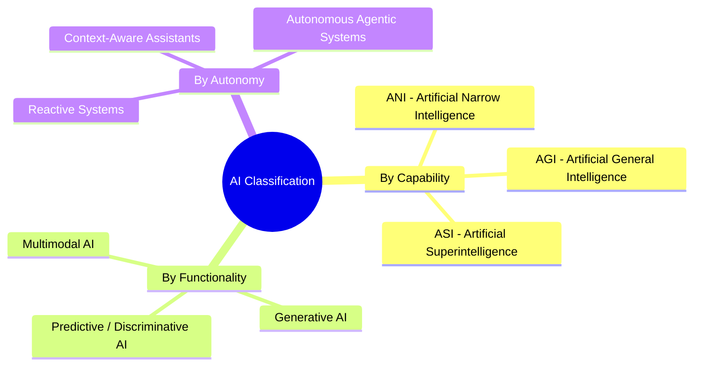

# Chapter 2: Types of Artificial Intelligence

## 1. Taxonomic Classification of AI

Artificial Intelligence can be categorized across multiple orthogonal dimensions: **Capability level**, **Functionality / Modality**, and **Autonomy & Workflow**.



---

## 2. Classification by Capability

### 2.1 Artificial Narrow Intelligence (ANI)
- **Definition:** Systems engineered to solve specific, bounded tasks with high proficiency.
- **Examples:** AlphaFold (protein folding), spam classifiers, chess engines, self-driving lane-detection models.
- **Current State:** 100% of currently deployed production systems are ANI.

### 2.2 Artificial General Intelligence (AGI)
- **Definition:** Hypothetical systems possessing human-level cognitive capabilities across reasoning, transfer learning, creative problem-solving, and abstract conceptualization across arbitrary domains.
- **Benchmark Metrics:** Multimodal broad reasoning, continuous zero-shot transfer learning, independent goal formulation.

### 2.3 Artificial Superintelligence (ASI)
- **Definition:** Theoretical AI systems that surpass aggregate human intellect across every field, including scientific creativity, general wisdom, and social skills.

---

## 3. Classification by Modality & Purpose

| Category | Primary Function | Core Technologies | Industry Examples |
| :--- | :--- | :--- | :--- |
| **Predictive AI** | Classify, regress, or forecast based on historical patterns | XGBoost, Random Forests, LSTMs | Credit scoring, churn prediction, fraud detection |
| **Generative AI** | Synthesize novel tokens (text, images, audio, code) | Diffusion Models, Autoregressive LLMs | Claude, Midjourney, GitHub Copilot |
| **Multimodal AI** | Process and align multiple input/output modalities | Vision-Language Models (VLMs), Cross-Attention | Gemini, GPT-4o (Vision + Audio + Text) |
| **Agentic AI** | Goal-directed reasoning, tool execution, state memory | ReAct framework, MCP, Planning algorithms | Autonomous coding agents, research assistants |

---

## 4. Engineering Comparison: Discriminative vs. Generative Model

Understanding the architectural distinction between calculating $P(Y|X)$ (discriminative/predictive) versus $P(X, Y)$ or $P(X_{next}|X_{context})$ (generative) is fundamental for AI engineers:

```python
"""
Comparing a Discriminative Classifier with an Autoregressive Generative Tokenizer/Predictor
"""
import math

# 1. Discriminative Paradigm: P(Class | Features)
class DiscriminativeClassifier:
    def __init__(self):
        # Weights representing log-odds contribution of features
        self.weights = {"error_rate": 2.5, "latency_ms": 0.01}
        self.bias = -3.0

    def predict_anomaly(self, error_rate: float, latency_ms: float) -> bool:
        score = (error_rate * self.weights["error_rate"]) + (latency_ms * self.weights["latency_ms"]) + self.bias
        probability = 1 / (1 + math.exp(-score))
        return probability > 0.5

# 2. Generative Paradigm: P(Next Token | Context)
class SimpleGenerativeLanguageModel:
    def __init__(self):
        # Transition probabilities (Bigram transition table)
        self.transitions = {
            "system": {"healthy": 0.7, "degraded": 0.3},
            "healthy": {"and": 0.6, "operational": 0.4},
            "degraded": {"requires": 0.8, "alert": 0.2},
            "requires": {"restart": 0.9, "investigation": 0.1}
        }

    def generate_next(self, current_word: str) -> str:
        options = self.transitions.get(current_word.lower(), {})
        if not options:
            return "<END>"
        # Select highest probability next token (Greedy Decoding)
        return max(options, key=options.get)

    def generate_sequence(self, start_word: str, max_tokens: int = 5) -> str:
        tokens = [start_word]
        for _ in range(max_tokens):
            next_token = self.generate_next(tokens[-1])
            if next_token == "<END>":
                break
            tokens.append(next_token)
        return " ".join(tokens)

# Demonstration
classifier = DiscriminativeClassifier()
generator = SimpleGenerativeLanguageModel()

print("Anomaly Detected:", classifier.predict_anomaly(error_rate=0.8, latency_ms=450))
print("Generated Log   :", generator.generate_sequence("degraded"))
```

---

## 5. Summary & Key Takeaways

- **Narrow vs General:** Today's frontier breakthroughs are hyper-capable **Narrow & Foundation AI**, not AGI.
- **Discriminative vs Generative:** Discriminative models separate data spaces (classification/regression), while Generative models learn data distributions to create new samples.
- **The Shift to Agentic:** Modern AI engineering is transitioning from static prompt-response interactions towards **autonomous agentic workflows**.

---

[Next Chapter: Machine Learning →](./chapter-3-machine-learning.md)

