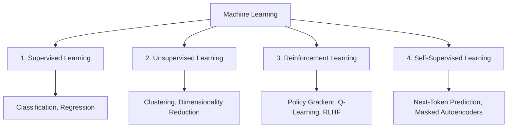
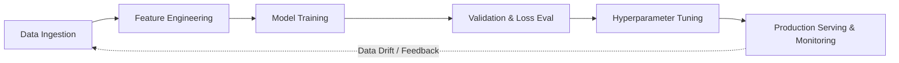

# Chapter 3: Machine Learning Foundations

## 1. What is Machine Learning?

**Machine Learning (ML)** is the scientific study of algorithms and statistical models that computer systems use to perform tasks without explicit instructions, relying on patterns and inference instead. Arthur Samuel (1959) famously defined ML as:
> *"The field of study that gives computers the ability to learn without being explicitly programmed."*

Mathematically, given a dataset $\mathcal{D} = \{(\mathbf{x}_i, y_i)\}_{i=1}^N$, the goal is to find a parameterized hypothesis function $f_\theta(\mathbf{x}) \approx y$ that minimizes an empirical loss function $\mathcal{L}(\theta)$.

---

## 2. Core Learning Paradigms



### 2.1 Supervised Learning
- **Dataset:** Pairs of input features $\mathbf{x}$ and ground-truth labels $y$.
- **Tasks:** 
  - **Regression:** Continuous value estimation (e.g., predicting cloud latency or housing prices).
  - **Classification:** Categorical mapping (e.g., fraud vs. legitimate transaction).

### 2.2 Unsupervised Learning
- **Dataset:** Unlabeled input points $\mathbf{x}$.
- **Tasks:** Finding intrinsic hidden structures.
  - **Clustering:** K-Means, HDBSCAN (customer segmentation).
  - **Dimensionality Reduction:** PCA, t-SNE, UMAP (vector embedding compression).

### 2.3 Reinforcement Learning (RL)
- **Framework:** An **Agent** interacts with an **Environment** across discrete time steps, observing state $s_t$, taking action $a_t$, and receiving scalar reward $r_t$ to maximize cumulative expected return.
- **Modern Significance:** RLHF (Reinforcement Learning from Human Feedback) and DPO (Direct Preference Optimization) are crucial for aligning LLMs (InstructGPT, Claude, Gemini).

---

## 3. The Machine Learning Lifecycle

Developing a production ML system follows a disciplined lifecycle:



### Key Statistical Concepts:
- **Bias-Variance Tradeoff:**
  - **Underfitting (High Bias):** Model is too simple to capture patterns in data.
  - **Overfitting (High Variance):** Model memorizes training noise and fails to generalize to validation/test sets.
- **Regularization:** Techniques ($L_1$, $L_2$, Dropout) added to penalize model complexity.

---

## 4. Hands-on Implementation: Training a Gradient Descent Model from Scratch

Here is a pure Python & NumPy implementation of Linear Regression with Gradient Descent:

```python
import numpy as np

class LinearRegressionGD:
    def __init__(self, learning_rate: float = 0.01, epochs: int = 1000):
        self.lr = learning_rate
        self.epochs = epochs
        self.weights = None
        self.bias = None
        self.loss_history = []

    def fit(self, X: np.ndarray, y: np.ndarray):
        n_samples, n_features = X.shape
        # Initialize parameters
        self.weights = np.zeros(n_features)
        self.bias = 0.0

        for epoch in range(self.epochs):
            # 1. Forward Pass (Linear Hypothesis: y_hat = X * w + b)
            y_pred = np.dot(X, self.weights) + self.bias
            
            # 2. Compute Mean Squared Error (MSE) Loss
            loss = np.mean((y_pred - y) ** 2)
            self.loss_history.append(loss)

            # 3. Compute Analytical Gradients (dLoss/dw and dLoss/db)
            dw = (2 / n_samples) * np.dot(X.T, (y_pred - y))
            db = (2 / n_samples) * np.sum(y_pred - y)

            # 4. Parameter Update via Gradient Descent Step
            self.weights -= self.lr * dw
            self.bias -= self.lr * db

            if epoch % 200 == 0:
                print(f"Epoch {epoch:4d} | MSE Loss: {loss:.4f}")

    def predict(self, X: np.ndarray) -> np.ndarray:
        return np.dot(X, self.weights) + self.bias

# Synthetic Experiment
if __name__ == "__main__":
    np.random.seed(42)
    # Generate linear dataset: y = 3.5 * x1 + 1.2 * x2 + 4.0 + noise
    X_train = np.random.randn(100, 2)
    true_w = np.array([3.5, 1.2])
    true_b = 4.0
    y_train = np.dot(X_train, true_w) + true_b + np.random.normal(0, 0.1, size=100)

    model = LinearRegressionGD(learning_rate=0.1, epochs=601)
    model.fit(X_train, y_train)

    print("\nLearned Weights:", model.weights.round(2), "(Expected ~ [3.5, 1.2])")
    print("Learned Bias   :", round(model.bias, 2), "(Expected ~ 4.0)")
```

---

## 5. Summary & Key Takeaways

1. **Learning is Optimization:** Machine Learning minimizes empirical risk over known data to generalize over unseen distributions.
2. **Data Quality > Algorithm Complexity:** Clean, well-labeled, representative data consistently outperforms complex models trained on poor data.
3. **Foundation for Deep Learning:** Deep neural networks are composed of stacks of parameterized linear transformations interleaved with non-linear activation functions.

---

[Next Chapter: Deep Learning and Neural Networks →](./chapter-4-deep-learning-neural-networks.md)

