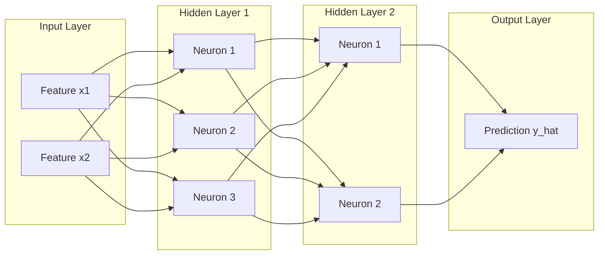

# Chapter 4: Deep Learning and Neural Networks

## 1. What is Deep Learning?

**Deep Learning (DL)** is a specialized subfield of Machine Learning based on Artificial Neural Networks (ANNs) with representation learning. The "deep" in deep learning refers to having multiple stacked layers between the input and output that progressively extract higher-level, hierarchical features from raw data.



---

## 2. Anatomy of an Artificial Neuron (Perceptron)

A single artificial neuron computes a weighted sum of its inputs, adds a learnable scalar bias, and passes the result through a non-linear **activation function**:

```text
z = sum(w_i * x_i) + b = (w^T * x) + b
a = activation_function(z)
```

### Common Activation Functions:
1. **ReLU (Rectified Linear Unit):** `f(z) = max(0, z)` — Standard default for hidden layers; avoids vanishing gradients.
2. **Sigmoid:** `f(z) = 1 / (1 + exp(-z))` — Compresses values to (0, 1); ideal for binary probability outputs.
3. **Softmax:** Converts an unnormalized vector of logits into a categorical probability distribution summing to 1.0.

---

## 3. Backpropagation and the Chain Rule

Neural networks learn by iteratively computing gradients of the loss function with respect to all internal parameters `W` and `b` via the **Chain Rule of Calculus**:

```text
dLoss / dW[l] = (dLoss / da[l]) * (da[l] / dz[l]) * (dz[l] / dW[l])
```


### Modern Optimizers:
- **SGD (Stochastic Gradient Descent):** Standard mini-batch updates.
- **Adam / AdamW (Adaptive Moment Estimation with Decoupled Weight Decay):** Maintains running averages of both gradients and their second moments; default optimizer for modern Transformers and LLMs.

---

## 4. End-to-End Implementation: 2-Layer Neural Network with Backprop in NumPy

```python
"""
A complete, from-scratch 2-Layer Multi-Layer Perceptron (MLP)
Solving the non-linear XOR classification problem
"""
import numpy as np

class TwoLayerMLP:
    def __init__(self, input_dim: int, hidden_dim: int, output_dim: int, lr: float = 0.1):
        self.lr = lr
        # He / Xavier Initialization
        self.W1 = np.random.randn(input_dim, hidden_dim) * np.sqrt(2.0 / input_dim)
        self.b1 = np.zeros((1, hidden_dim))
        self.W2 = np.random.randn(hidden_dim, output_dim) * np.sqrt(2.0 / hidden_dim)
        self.b2 = np.zeros((1, output_dim))

    def relu(self, z):
        return np.maximum(0, z)

    def relu_derivative(self, z):
        return (z > 0).astype(float)

    def sigmoid(self, z):
        return 1.0 / (1.0 + np.exp(-np.clip(z, -500, 500)))

    def forward(self, X: np.ndarray):
        # Layer 1
        self.z1 = np.dot(X, self.W1) + self.b1
        self.a1 = self.relu(self.z1)
        # Layer 2
        self.z2 = np.dot(self.a1, self.W2) + self.b2
        self.a2 = self.sigmoid(self.z2)
        return self.a2

    def backward(self, X: np.ndarray, y: np.ndarray):
        m = X.shape[0]
        # Binary Cross-Entropy gradient at output layer
        dz2 = self.a2 - y
        dW2 = (1 / m) * np.dot(self.a1.T, dz2)
        db2 = (1 / m) * np.sum(dz2, axis=0, keepdims=True)

        # Backpropagation into Hidden Layer
        da1 = np.dot(dz2, self.W2.T)
        dz1 = da1 * self.relu_derivative(self.z1)
        dW1 = (1 / m) * np.dot(X.T, dz1)
        db1 = (1 / m) * np.sum(dz1, axis=0, keepdims=True)

        # Gradient Descent Parameter Update
        self.W1 -= self.lr * dW1
        self.b1 -= self.lr * db1
        self.W2 -= self.lr * dW2
        self.b2 -= self.lr * db2

    def train(self, X: np.ndarray, y: np.ndarray, epochs: int = 5000):
        for epoch in range(epochs):
            y_hat = self.forward(X)
            # Binary Cross Entropy Loss
            loss = -np.mean(y * np.log(y_hat + 1e-8) + (1 - y) * np.log(1 - y_hat + 1e-8))
            self.backward(X, y)
            if epoch % 1000 == 0:
                print(f"Epoch {epoch:4d} | BCE Loss: {loss:.5f}")

# Train on XOR problem (non-linearly separable)
if __name__ == "__main__":
    X_xor = np.array([[0, 0], [0, 1], [1, 0], [1, 1]])
    y_xor = np.array([[0], [1], [1], [0]])

    net = TwoLayerMLP(input_dim=2, hidden_dim=4, output_dim=1, lr=0.5)
    net.train(X_xor, y_xor, epochs=4001)

    print("\n--- Predictions on XOR ---")
    preds = net.forward(X_xor)
    for inp, pred in zip(X_xor, preds):
        print(f"Input: {inp} -> Predicted: {pred[0]:.4f} (Class: {int(pred[0] > 0.5)})")
```

---

## 5. Summary & Key Takeaways

1. **Universal Approximation:** Neural networks with non-linear activation functions can approximate any continuous mathematical function given sufficient capacity.
2. **End-to-End Representation:** Unlike traditional ML requiring manual feature engineering, Deep Learning automatically discovers latent representations directly from raw inputs.
3. **Bridge to LLMs:** Transformers and modern Large Language Models are gigantic deep neural networks trained with billions of parameters over massive compute clusters.

---

[Next Chapter: Modern Generative AI →](../generative-ai/chapter-5-generative-ai.md)

