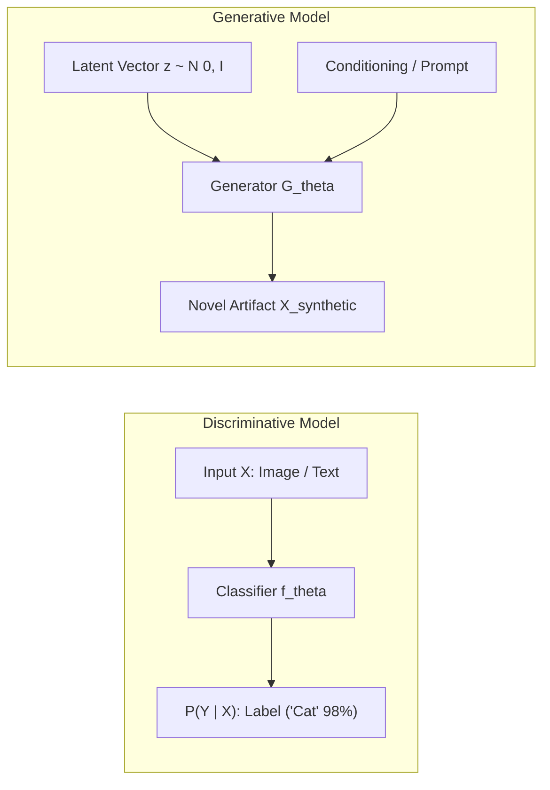
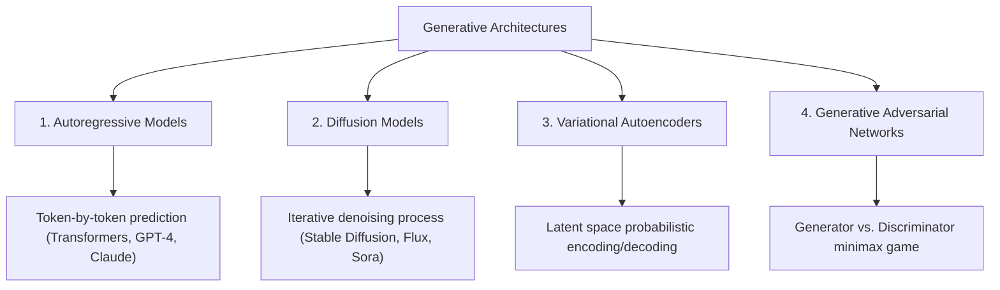

# Chapter 5: Generative AI Foundations

## 1. What is Generative AI?

**Generative AI** is a branch of artificial intelligence focused on synthesizing novel, high-dimensional artifacts—such as natural text, photorealistic imagery, synthetic voice, video, and source code—that reflect the statistical patterns and semantic distribution of human-created training data.

While traditional discriminative AI calculates class probabilities $P(Y|\mathbf{X})$, generative models model the joint distribution $P(\mathbf{X}, Y)$ or the high-dimensional data density $P(\mathbf{X})$.



---

## 2. Taxonomy of Generative Architectures

Modern generative engineering relies on four major foundational model families:



### 2.1 Autoregressive Language Models
Models decompose sequence generation into a conditional chain of probabilities via the product rule:
$$P(x_1, x_2, \dots, x_T) = \prod_{t=1}^T P(x_t \mid x_1, \dots, x_{t-1})$$

### 2.2 Diffusion Models
Operate via a two-stage thermodynamic process:
1. **Forward Process ($q$):** Gradually inject Gaussian noise into data over $T$ timesteps until it becomes pure isotropic noise.
2. **Reverse Process ($p_\theta$):** A learned U-Net or DiT (Diffusion Transformer) iteratively denoises the latent representation conditioned on text embeddings.

---

## 3. Sampling Strategies & Decoding Parameters

When generating text from probabilistic models, sampling strategies govern creativity vs. determinism:

| Parameter | Function | Typical Values | Engineering Tradeoff |
| :--- | :--- | :--- | :--- |
| **Temperature ($T$)** | Rescales logits prior to softmax: $P(w_i) \propto e^{z_i / T}$ | `0.0` (code/facts) to `0.8` (creative) | Low $T$ is deterministic; high $T$ increases diversity but risks hallucination. |
| **Top-K Sampling** | Restricts candidate tokens to the $K$ highest logits | `40` – `50` | Filters out improbable tail tokens. |
| **Top-P (Nucleus)** | Dynamically samples from smallest token set whose cumulative probability $\ge P$ | `0.90` – `0.95` | Adapts contextually when distribution is flat vs. sharp. |

---

## 4. Hands-on Implementation: Temperature, Top-P, and Top-K Sampling Engine

```python
"""
Production-grade Implementation of Softmax Temperature, Top-K, and Top-P (Nucleus) Sampling
"""
import numpy as np

def sample_next_token(
    logits: np.ndarray,
    temperature: float = 1.0,
    top_k: int = 0,
    top_p: float = 1.0
) -> int:
    logits = np.array(logits, dtype=np.float64)

    # 1. Apply Temperature Scaling
    if temperature <= 1e-5:
        return int(np.argmax(logits))  # Greedy ArgMax
    logits = logits / temperature

    # 2. Top-K Filtering
    if top_k > 0:
        top_k = min(max(top_k, 1), logits.size)
        indices_to_remove = logits < np.sort(logits)[-top_k]
        logits[indices_to_remove] = -np.inf

    # 3. Softmax Transformation
    exp_logits = np.exp(logits - np.max(logits))
    probs = exp_logits / np.sum(exp_logits)

    # 4. Top-P (Nucleus) Filtering
    if top_p < 1.0:
        sorted_indices = np.argsort(probs)[::-1]
        sorted_probs = probs[sorted_indices]
        cumulative_probs = np.cumsum(sorted_probs)

        # Remove tokens with cumulative probability above threshold
        sorted_indices_to_remove = cumulative_probs > top_p
        # Shift mask right to keep at least the first token above threshold
        sorted_indices_to_remove[1:] = sorted_indices_to_remove[:-1]
        sorted_indices_to_remove[0] = False

        indices_to_remove = sorted_indices[sorted_indices_to_remove]
        probs[indices_to_remove] = 0.0
        probs = probs / np.sum(probs)  # Re-normalize

    # 5. Categorical Draw
    return int(np.random.choice(len(probs), p=probs))

# Demonstration
if __name__ == "__main__":
    vocab = ["fast", "accurate", "reliable", "unstable", "hallucinatory", "slow"]
    mock_logits = np.array([2.5, 2.2, 1.8, 0.4, -1.2, -0.8])

    print("--- Greedy (Temp = 0.0) ---")
    print("Picked:", vocab[sample_next_token(mock_logits, temperature=0.0)])

    print("\n--- Creative Top-P (Temp = 0.8, Top-P = 0.85) ---")
    samples = [vocab[sample_next_token(mock_logits, temperature=0.8, top_p=0.85)] for _ in range(5)]
    print("Samples:", samples)
```

---

## 5. Summary & Key Takeaways

1. **Probabilistic Nature:** Generative AI is inherently statistical; outputs are sampled from high-dimensional learned density functions.
2. **Control Knobs:** Understanding Temperature, Top-P, and Top-K is crucial for tuning LLMs for deterministic extraction vs. creative synthesis.
3. **Foundation for Agentic Systems:** Generative models serve as the reasoning and natural language interface for modern autonomous agents.

---

[Next Chapter: Large Language Models →](./chapter-6-large-language-models.md)

