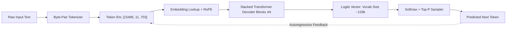
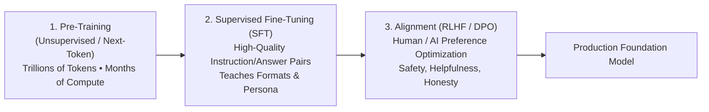

# Chapter 6: Large Language Models (LLMs)

## 1. What are Large Language Models?

**Large Language Models (LLMs)** are foundation models parameterized by tens or hundreds of billions of weights, trained on massive web-scale corpora using self-supervised causal language modeling. At their computational core, LLMs are autoregressive probability estimators that iteratively predict the next token given an input context:

$$P(w_1, w_2, \dots, w_n) = \prod_{i=1}^n P(w_i \mid w_1, \dots, w_{i-1})$$



---

## 2. The 3-Stage LLM Training Pipeline

Transforming raw web data into a helpful, aligned assistant requires three distinct training phases:



1. **Pre-training:** Learns world knowledge, grammar, coding syntax, and broad reasoning by ingesting 5–15+ trillion tokens (Common Crawl, GitHub, ArXiv, Books).
2. **Supervised Fine-Tuning (SFT / Instruct Tuning):** Curated multi-turn dialogues teaching the model how to act as an assistant rather than just completing raw text.
3. **Preference Alignment (RLHF & DPO):**
   - **RLHF (Reinforcement Learning from Human Feedback):** Trains a Reward Model on human preferences, optimizing policy via PPO (Proximal Policy Optimization).
   - **DPO (Direct Preference Optimization):** Derives policy updates directly from binary preference pairs without requiring an explicit separate reward model.

---

## 3. Tokenization & Byte-Pair Encoding (BPE)

LLMs do not process raw strings directly; text is decomposed into discrete **Tokens** (sub-words). Subword algorithms like **Byte-Pair Encoding (BPE)** and **SentencePiece** balance vocabulary size against sequence length.

### Engineering Rules of Thumb:
- **1 Token $\approx$ 0.75 English Words** (or $\approx$ 4 characters).
- Numbers, whitespace, code indentation, and non-English scripts often require more tokens per character.

---

## 4. Hands-on Implementation: Minimal Byte-Pair Encoding (BPE) Tokenizer

```python
"""
A Minimal Byte-Pair Encoding (BPE) Tokenizer Implementation
Demonstrating how LLMs learn vocabulary merges from raw text
"""
from collections import Counter

class SimpleBPETokenizer:
    def __init__(self, target_vocab_size: int = 10):
        self.target_vocab_size = target_vocab_size
        self.merges = {}

    def get_stats(self, vocab: dict) -> dict:
        pairs = Counter()
        for word, freq in vocab.items():
            symbols = word.split()
            for i in range(len(symbols) - 1):
                pairs[symbols[i], symbols[i + 1]] += freq
        return pairs

    def merge_vocab(self, pair: tuple, vocab: dict) -> dict:
        v_out = {}
        bigram = " ".join(pair)
        replacement = "".join(pair)
        for word in vocab:
            w_out = word.replace(bigram, replacement)
            v_out[w_out] = vocab[word]
        return v_out

    def train(self, corpus: list[str]):
        # Initialize word counts with space-separated characters and end-of-word marker </w>
        words = [word for text in corpus for word in text.split()]
        vocab = Counter([" ".join(list(word)) + " </w>" for word in words])

        print("Initial Vocabulary:", dict(vocab))

        for i in range(self.target_vocab_size):
            pairs = self.get_stats(vocab)
            if not pairs:
                break
            best_pair = max(pairs, key=pairs.get)
            vocab = self.merge_vocab(best_pair, vocab)
            self.merges[best_pair] = "".join(best_pair)
            print(f"Merge #{i+1:02d}: {best_pair} -> '{self.merges[best_pair]}'")

        return vocab

# Demonstration
if __name__ == "__main__":
    sample_text = ["low lower lowest newest widest wider"]
    tokenizer = SimpleBPETokenizer(target_vocab_size=6)
    final_vocab = tokenizer.train(sample_text)
    print("\nFinal Learned Subword Tokens:")
    for token, count in final_vocab.items():
        print(f" - {token} (Count: {count})")
```

---

## 5. Summary & Key Takeaways

1. **Next-Token Prediction:** Despite complex multi-step reasoning abilities, foundation LLMs are mathematically optimized for conditional autoregressive sequence modeling.
2. **Emergent Abilities & Scaling Laws:** As compute, dataset size, and parameter counts scale predictably (Kaplan / Chinchilla Scaling Laws), models demonstrate zero-shot emergent capabilities.
3. **Alignment is Critical:** Raw pre-trained base models need SFT and RLHF/DPO to become safe, steerable, and instruction-following AI assistants.

---

[Next Chapter: Transformers Architecture →](./chapter-7-transformers.md)

