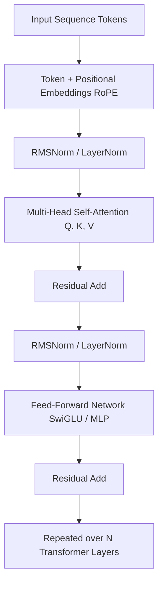

# Chapter 7: The Transformer Architecture

## 1. The Core Paradigm Shift

Introduced by Vaswani et al. in the landmark 2017 paper *"Attention Is All You Need"*, the **Transformer** replaced recurrent neural networks (RNNs/LSTMs) and convolutions with an entirely attention-based mechanism. 

### Why Transformers Won:
- **Massive Parallelization:** Unlike RNNs which compute step-by-step, Transformers process all sequence tokens concurrently in GPU memory.
- **Direct Constant Path Length:** The distance between any two tokens across the sequence is constant O(1), eliminating catastrophic forgetting across long context windows.



---

## 2. Scaled Dot-Product Attention

The core mathematical engine of the Transformer computes query-key similarity scores to take a weighted average of value vectors:

```text
Attention(Q, K, V) = softmax( (Q * K^T) / sqrt(d_k) + M ) * V
```

- **Q** (Queries: "What am I looking for?")
- **K** (Keys: "What information do I contain?")
- **V** (Values: "What content do I provide?")
- `sqrt(d_k)`: Scaling factor preventing logits from exploding into regions with near-zero softmax gradients.
- `M`: Causal autoregressive mask setting upper-triangular elements to -inf to prevent attending to future tokens.

---

## 3. Multi-Head Attention (MHA) & KV Caching

Instead of performing a single attention function, **Multi-Head Attention** linearly projects the queries, keys, and values `h` times:

```text
MultiHead(Q, K, V) = Concat(head_1, ..., head_h) * W_O
```

### Modern Architectural Innovations:
- **Grouped-Query Attention (GQA):** Multiple query heads share a single key-value head (e.g. LLaMA 3, Mistral), reducing KV-cache VRAM consumption during inference by 4x–8x.
- **RoPE (Rotary Position Embeddings):** Encodes absolute positions with a rotation matrix, enabling relative position decay.

---

## 4. Hands-on Implementation: Scaled Dot-Product & Causal Masking in Pure NumPy

```python
"""
Scaled Dot-Product Attention with Causal Masking from Scratch in NumPy
"""
import numpy as np

def scaled_dot_product_attention(
    Q: np.ndarray, 
    K: np.ndarray, 
    V: np.ndarray, 
    causal_mask: bool = True
) -> tuple[np.ndarray, np.ndarray]:
    d_k = Q.shape[-1]
    seq_len = Q.shape[-2]

    # 1. Compute Raw Attention Scores: Q * K^T / sqrt(d_k)
    scores = np.matmul(Q, K.swapaxes(-1, -2)) / np.sqrt(d_k)

    # 2. Apply Causal Autoregressive Mask
    if causal_mask:
        mask = np.triu(np.ones((seq_len, seq_len)), k=1)
        scores = np.where(mask == 1, -1e9, scores)

    # 3. Softmax along the last dimension (Attention Weights)
    exp_scores = np.exp(scores - np.max(scores, axis=-1, keepdims=True))
    attention_weights = exp_scores / np.sum(exp_scores, axis=-1, keepdims=True)

    # 4. Context Vector: Attention Weights * V
    output = np.matmul(attention_weights, V)
    return output, attention_weights

# Demonstration with a 4-token sequence and embedding dim = 8
if __name__ == "__main__":
    np.random.seed(42)
    seq_len, d_k = 4, 8

    Q = np.random.randn(seq_len, d_k)
    K = np.random.randn(seq_len, d_k)
    V = np.random.randn(seq_len, d_k)

    context_out, weights = scaled_dot_product_attention(Q, K, V, causal_mask=True)

    print("--- Causal Attention Matrix (Weights) ---")
    print(np.round(weights, 3))
    print("\nOutput Shape:", context_out.shape)
```

---

## 5. Summary & Key Takeaways

1. **Attention is Routing:** Attention dynamically computes pairwise affinity weights between tokens based on semantic context.
2. **Causal Masking:** Autoregressive generation strictly enforces lower-triangular causal attention to preserve sequence causality.
3. **Hardware Affinity:** The Transformer is inherently optimized for modern tensor-core matrix accelerators.

---

[Next Chapter: Prompt Engineering →](./chapter-8-prompt-engineering.md)
