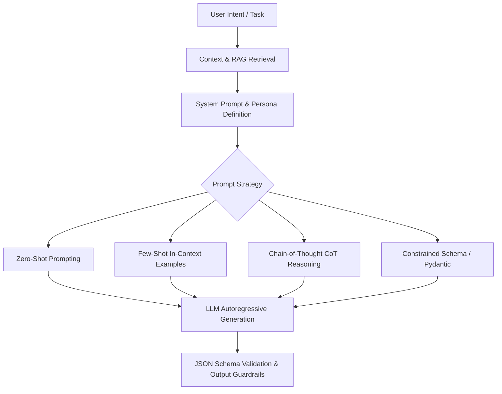

# Chapter 8: Prompt Engineering & In-Context Learning

## 1. What is Prompt Engineering?

**Prompt Engineering** is the discipline of structuring input text and context to guide foundation models toward generating optimal, deterministic, and safe responses without updating the model's underlying parameter weights. It represents software engineering with natural language as the programming medium.



---

## 2. Core Prompting Methodologies

### 2.1 Zero-Shot vs. Few-Shot In-Context Learning
- **Zero-Shot:** Direct task instruction without historical demonstration.
- **Few-Shot:** Providing 2–5 exemplar input/output pairs in the context window. This conditions the autoregressive prior, drastically improving format conformance and nuanced edge-case handling.

### 2.2 Chain-of-Thought (CoT) & Least-to-Most Reasoning
Forcing the LLM to emit intermediate reasoning steps (*"Think step by step"*) allocates more forward-pass compute tokens to complex mathematical, algorithmic, or multi-step logic problems before committing to a final answer.

### 2.3 System Prompt Anatomy (Production Best Practice)
A robust production system prompt contains five distinct semantic sections:
1. **Role & Identity:** (e.g., "You are an expert distributed systems engineer...")
2. **Context & Boundaries:** Hard constraints on knowledge cutoff and disallowed actions.
3. **Task Instructions:** Step-by-step procedure.
4. **Few-Shot Demonstrations:** Clear input/output schema examples.
5. **Output Format Enforcement:** Rigid XML or JSON schema instructions.

---

## 3. Production JSON Schema & Structured Extraction

Modern AI engineering relies heavily on extracting strongly-typed, machine-parseable JSON outputs from LLMs for downstream consumption by backend microservices.

---

## 4. Hands-on Implementation: Robust Structured Prompt Engine in Python

```python
"""
Production Prompt Template Engine with Few-Shot Framing and JSON Parsing
"""
import json
import re

class StructuredPromptBuilder:
    def __init__(self, system_role: str):
        self.system_role = system_role
        self.examples = []
        self.output_schema = None

    def add_example(self, input_text: str, expected_output: dict):
        self.examples.append({"input": input_text, "output": expected_output})

    def set_schema(self, schema_description: str):
        self.output_schema = schema_description

    def build_prompt(self, user_query: str) -> str:
        prompt_parts = [
            f"<SYSTEM>\n{self.system_role}\n</SYSTEM>\n",
            f"<CONSTRAINTS>\nAlways return valid, minified JSON adhering to this schema:\n{self.output_schema}\n</CONSTRAINTS>\n"
        ]

        if self.examples:
            prompt_parts.append("<EXAMPLES>")
            for idx, ex in enumerate(self.examples, 1):
                prompt_parts.append(f"Example #{idx}:\nInput: {ex['input']}\nOutput:\n{json.dumps(ex['output'])}")
            prompt_parts.append("</EXAMPLES>\n")

        prompt_parts.append(f"<TASK>\nInput: {user_query}\nOutput:\n</TASK>")
        return "\n".join(prompt_parts)

# Demonstration
if __name__ == "__main__":
    builder = StructuredPromptBuilder(
        system_role="You are an autonomous incident triaging engine. Analyze logs and extract root cause."
    )
    builder.set_schema('{"severity": "LOW|MED|CRITICAL", "component": "str", "action_required": "str"}')
    builder.add_example(
        input_text="Disk read latency spiked to 2500ms on shard-04.",
        expected_output={"severity": "CRITICAL", "component": "storage/shard-04", "action_required": "failover_replica"}
    )

    final_prompt = builder.build_prompt("Cache hit ratio dropped below 40% on redis-cluster-west.")
    print("--- Formatted Production Prompt ---")
    print(final_prompt)
```

---

## 5. Summary & Key Takeaways

1. **Tokens Equal Compute:** Chain-of-Thought prompting gives the model scratchpad compute space to perform step-by-step deduction.
2. **Few-Shot Anchors Distribution:** Providing high-quality examples is the most effective way to eliminate formatting errors without fine-tuning.
3. **Structured Formats:** Always isolate system rules, examples, and user input with clear delimiter tags (e.g., XML tags like `<SYSTEM>`, `<CONTEXT>`).

---

[Next Chapter: Embeddings (Part III: AI Engineering) →](../ai-engineering/chapter-9-embeddings.md)
