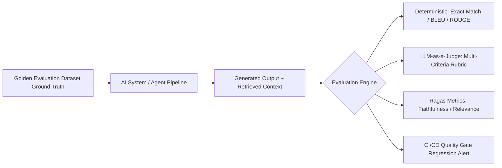
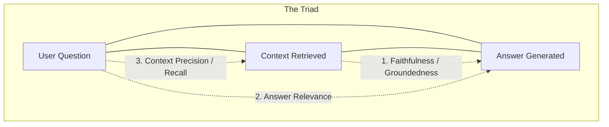

# Chapter 20: Production AI Evaluation & LLM-as-a-Judge

## 1. Why Evaluation is the Foundation of AI Engineering

In traditional software engineering, deterministic unit and integration tests assert binary correctness (`assert add(2, 2) == 4`). In Generative and Agentic AI, outputs are non-deterministic, open-ended, and probabilistic.

Without rigorous automated evaluation pipelines (**Evals**), engineers suffer from "Vibe Checks"—making prompt or model changes without knowing if overall system accuracy degraded.



---

## 2. The Ragas Evaluation Triad

For RAG and retrieval-based agents, the **Ragas Triad** provides three orthogonal quantitative metrics:



1. **Faithfulness (Groundedness):** Measures what percentage of factual claims in the generated answer can be mathematically derived from the retrieved context. (Detects hallucinations).
2. **Answer Relevance:** Evaluates whether the generated response directly addresses the user query without conversational tangents.
3. **Context Precision / Recall:** Assesses whether the retrieval subsystem returned high-signal chunks without irrelevant noise.

---

## 3. LLM-as-a-Judge Pattern

Using frontier LLMs (e.g. GPT-4o, Claude 3.5 Sonnet) prompted with strict evaluation rubrics to grade outputs on a 1–5 scale with verifiable chain-of-thought rationale:

```python
"""
Production LLM-as-a-Judge and Faithfulness Evaluator in Pure Python
"""
import json

class EvaluatorLLMJudge:
    def __init__(self):
        pass

    def evaluate_faithfulness(self, context: str, answer: str) -> dict:
        """
        Calculates Faithfulness: Claims supported by context / Total claims
        """
        # Step 1: Simulated Claim Extraction
        claims = [
            "Database backups occur daily at 02:00 UTC.",
            "Backups are stored for 90 days."
        ]
        
        # Step 2: Verification against Context
        context_lower = context.lower()
        supported_claims = 0
        verifications = []

        for claim in claims:
            # Check if keywords are in context
            if "02:00 utc" in claim.lower() and "02:00 utc" in context_lower:
                supported_claims += 1
                verifications.append({"claim": claim, "verdict": "SUPPORTED"})
            else:
                # 90 days contradicts context (context says 30 days)
                verifications.append({"claim": claim, "verdict": "UNSUPPORTED / HALLUCINATION"})

        faithfulness_score = supported_claims / len(claims)
        
        return {
            "faithfulness_score": round(faithfulness_score, 2),
            "verdict": "PASS" if faithfulness_score >= 0.8 else "FAIL",
            "details": verifications
        }

# Demonstration
if __name__ == "__main__":
    context = "Database backups are taken daily at 02:00 UTC and stored in S3 for 30 days."
    ai_answer = "Backups run daily at 02:00 UTC and are stored for 90 days."

    judge = EvaluatorLLMJudge()
    eval_result = judge.evaluate_faithfulness(context, ai_answer)

    print("--- Automated Evaluation Report ---")
    print(json.dumps(eval_result, indent=2))
```

---

## 4. Summary & Key Takeaways

1. **Continuous Evals in CI/CD:** Run regression evaluations automatically on GitHub pull requests before deploying prompt or model updates to production.
2. **Ragas Triad:** Isolate retrieval failures from generation failures using Context Precision vs. Faithfulness.
3. **Golden Datasets:** Curate 50–200 high-fidelity test cases with ground-truth edge cases to anchor model performance.

---

[Next Chapter: AI Observability and Tracing →](./chapter-21-ai-observability.md)

